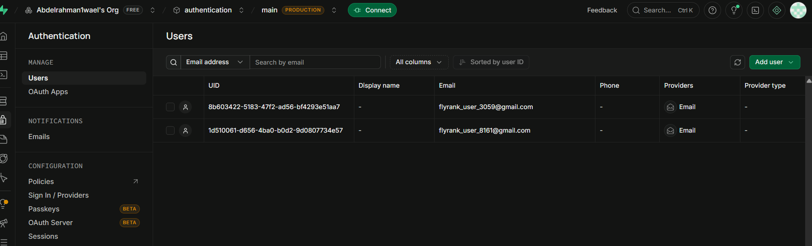
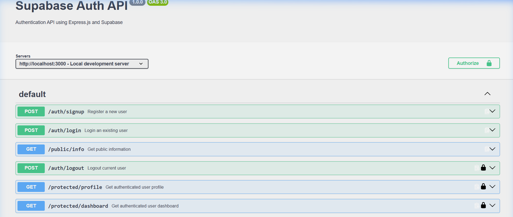

# 🚀 FlyRank Supabase Auth API Gateway

A robust, enterprise-grade **Node.js Express API Gateway** integrated with **Supabase Authentication** and **Swagger UI (OpenAPI 3.0)** documentation featuring Bearer JWT token protection on endpoints.

---

## 📸 Visual Overview & Architecture

### 1. Supabase Auth User Management Dashboard
User signups and authentications created via the Express API Gateway are automatically synchronized and managed inside your cloud-hosted Supabase Auth database.



---

### 2. Interactive Swagger UI Documentation (`/docs`)
Explore and test all endpoints interactively via Swagger UI. Protected routes display a **lock icon (🔒)** and require Bearer JWT token authorization.



---

## ✨ Features

- **Supabase Authentication Integration**: End-to-end user signup, password login, and session logout powered by `@supabase/supabase-js`.
- **Bearer JWT Token Authorization Middleware**: Efficient Express middleware (`requireAuth`) that validates incoming HTTP `Authorization: Bearer <token>` headers against Supabase Auth.
- **OpenAPI 3.0 & Swagger UI**: Auto-generated interactive API docs served at `/docs` with global `BearerAuth` scheme support.
- **Granular Route Protection**: Clear separation between public endpoints (`/health`, `/public/info`, `/auth/signup`, `/auth/login`) and protected endpoints (`/protected/profile`, `/protected/dashboard`, `/auth/logout`).

---

## 📊 API Endpoint Reference

| Method | Endpoint | Authorization | Description |
| :--- | :--- | :--- | :--- |
| `GET` | `/health` | 🔓 Public | Server health status check |
| `GET` | `/public/info` | 🔓 Public | Sample public information endpoint |
| `POST` | `/auth/signup` | 🔓 Public | Register a new user with email & password |
| `POST` | `/auth/login` | 🔓 Public | Authenticate user and receive Supabase JWT token |
| `POST` | `/auth/logout` | 🔒 Bearer JWT | Invalidate and sign out current Supabase user session |
| `GET` | `/protected/profile` | 🔒 Bearer JWT | Retrieve authenticated user profile metadata |
| `GET` | `/protected/dashboard` | 🔒 Bearer JWT | Retrieve protected user dashboard statistics |

---

## 🛠️ Prerequisites & Setup

### 1. Prerequisites
- **Node.js**: v18.0.0 or higher
- **Supabase Account**: A Supabase project with active `SUPABASE_URL` and `SUPABASE_ANON_KEY`.

### 2. Environment Configuration
Create a `.env` file in the root directory:

```env
PORT=3000
SUPABASE_URL=https://your-supabase-project.supabase.co
SUPABASE_ANON_KEY=your-supabase-anon-key
```

### 3. Installation
Install project dependencies:

```bash
npm install
```

---

## 🚀 Running the Server

### Development Mode (with Auto-Reload)
```bash
npm run dev
```

### Production Mode
```bash
npm start
```

Once started, the server will output:
```text
=================================
🚀 Server started successfully
📡 API: http://localhost:3000
❤️  Health: http://localhost:3000/health
📚 Swagger: http://localhost:3000/docs
=================================
```

---

## 🧪 Testing Authorization End-to-End

### Option A: Using Swagger UI in Browser
1. Open [http://localhost:3000/docs](http://localhost:3000/docs) in your browser.
2. Click the **Authorize 🔒** button at the top right.
3. Enter your Supabase access token (JWT) in the `Value` input field and click **Authorize**.
4. Test protected routes such as `GET /protected/profile` or `GET /protected/dashboard` directly from the browser!

### Option B: Automated Test Script
Run the built-in endpoint test runner:

```bash
npm test
```

---

## 📁 Project Structure

```text
FlyRank-Login-protect/
├── server.js              # Express app, Supabase auth middleware & OpenAPI spec
├── package.json           # Dependencies and scripts
├── .env                   # Environment configuration (Supabase URL & Anon Key)
├── test_endpoints.js      # End-to-end API test script
├── swger.png              # Swagger UI documentation screenshot
└── supbase_2user.png      # Supabase Dashboard users screenshot
```

---

## 📄 License

This project is open source and available under the [MIT License](LICENSE).
