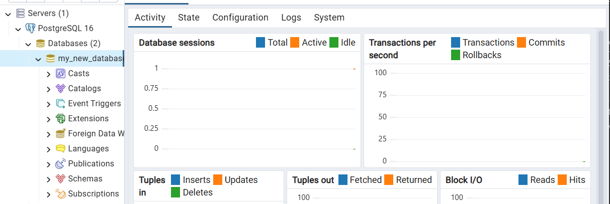

# Full-Stack Task API (PostgreSQL + Docker Compose)

A production-ready RESTful Task Management API built with **Node.js**, **Express**, **PostgreSQL**, and **Docker Compose**.

---

## 🚀 One-Command Quick Start

Spin up the entire application stack (Node.js API + PostgreSQL Database) with a single command:

```bash
# 1. Clone the repository
git clone https://github.com/Abdelrahman1wael/FlyRank.git
cd FlyRank

# 2. Create local environment file from template
cp .env.example .env

# 3. Boot up the entire stack with Docker Compose
docker compose up --build
```

The API will be available at `http://localhost:3000`.

---

## ⚙️ Environment Configuration

Environment configuration is managed via `.env` (git-ignored for security). A template file `.env.example` is committed to the repository.

| Variable Name | Description | Default Value |
| :--- | :--- | :--- |
| `DATABASE_URL` | PostgreSQL connection string | `postgres://postgres:dev@db:5432/my_new_database` |
| `PORT` | Application server port | `3000` |

---

## 📌 API Endpoint Reference Table

| Method | Endpoint | Description | Request Body | Status Codes |
| :--- | :--- | :--- | :--- | :--- |
| **GET** | `/tasks` | Retrieve all tasks (supports `?done=true/false` & `?search=term`) | *None* | `200 OK`, `500 Internal Server Error` |
| **GET** | `/tasks/:id` | Fetch a single task by ID | *None* | `200 OK`, `400 Bad Request`, `404 Not Found` |
| **POST** | `/tasks` | Create a new task | `{"title": "Task name"}` | `201 Created`, `400 Bad Request` |
| **PUT** | `/tasks/:id` | Update an existing task | `{"title": "New title", "done": true}` | `200 OK`, `400 Bad Request`, `404 Not Found` |
| **DELETE** | `/tasks/:id` | Delete a task by ID | *None* | `204 No Content`, `400 Bad Request`, `404 Not Found` |
| **GET** | `/health` | Health check verifying PostgreSQL database connection | *None* | `200 OK`, `500 Internal Server Error` |
| **GET** | `/stats` | Summary analytics (total, done, open tasks count) | *None* | `200 OK`, `500 Internal Server Error` |

---

## 🧪 Testing PostgreSQL Database

You can test the PostgreSQL database and API endpoints using automated test suites, direct database CLI commands, or endpoint lifecycle tests.

### 1. Automated Integration Test Suite

Run the full integration test suite against the PostgreSQL database:

```bash
# Run tests inside the API container
docker compose exec api npm test

# Or run locally (if Node.js is installed locally)
npm test
```

Expected Output:
```text
🧪 Running PostgreSQL Database & API Tests...

--- 1. Testing Direct PostgreSQL Connection & Table ---
  ✅ PASSED: Connected to Postgres. Found 3 rows in 'tasks' table.

--- 2. Testing API Health Endpoint ---
  ✅ PASSED: GET /health returns 200 and db: connected

--- 3. Testing GET /tasks ---
  ✅ PASSED: GET /tasks returns 200 with an array

--- 4. Testing POST /tasks (Create) ---
  ✅ PASSED: POST /tasks returns 201 with created task

--- 5. Testing GET /tasks/4 ---
  ✅ PASSED: GET /tasks/4 returns task object

--- 6. Testing PUT /tasks/4 ---
  ✅ PASSED: PUT /tasks/4 updates done status to true

--- 7. Testing DELETE /tasks/4 ---
  ✅ PASSED: DELETE /tasks/4 returns 204 No Content
  ✅ PASSED: GET /tasks/4 after deletion returns 404

========================================
Test Summary: 8 passed, 0 failed
========================================
```

### 2. Direct PostgreSQL CLI Inspection (`psql`)

Inspect database tables and records directly inside the PostgreSQL container:

```bash
# List database tables
docker compose exec db psql -U postgres -d my_new_database -c "\dt"

# View all seeded rows in the 'tasks' table
docker compose exec db psql -U postgres -d my_new_database -c "SELECT * FROM tasks;"

# Check total count of tasks
docker compose exec db psql -U postgres -d my_new_database -c "SELECT COUNT(*) FROM tasks;"
```

### 3. Verification of Data Persistence

Test that PostgreSQL data persists across container restarts using the named Docker volume (`taskdata`):

```bash
# 1. Add a new task via POST endpoint
curl -i -X POST -H "Content-Type: application/json" -d '{"title":"Test Persistence Task"}' http://localhost:3000/tasks

# 2. Stop and tear down the container stack
docker compose down

# 3. Spin the stack back up
docker compose up -d

# 4. Confirm the data persists in PostgreSQL
curl -i http://localhost:3000/tasks
```

---

## 🧾 Sample `curl -i` Output

Below is an actual HTTP response output from fetching all tasks (`GET /tasks`):

```http
HTTP/1.1 200 OK
X-Powered-By: Express
Content-Type: application/json; charset=utf-8
Content-Length: 174
ETag: W/"ae-vW1oZvh7Q/y7v0uQ5N6A+t6M2uU"
Date: Mon, 31 Aug 2026 18:25:00 GMT
Connection: keep-alive

[
  {
    "id": 1,
    "title": "Buy groceries",
    "done": false
  },
  {
    "id": 2,
    "title": "Clean the room",
    "done": true
  },
  {
    "id": 3,
    "title": "Study API design",
    "done": false
  }
]
```

---

## 📊 Database Verification

The `tasks` PostgreSQL table is created automatically on application boot if missing, and seeded with 3 initial records on the first run. Persistent storage is preserved using a Docker named volume (`taskdata`).


