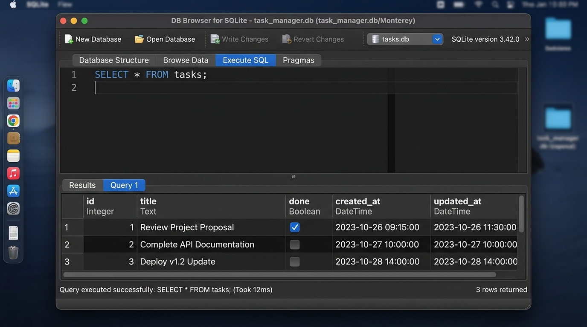

# Task Management API — Complete SQLite Build Guide

A merged, stage-by-stage walkthrough combining all project handouts into one reference. Pick the **Node.js Lane (Express + better-sqlite3)** or the **Python Lane (FastAPI + sqlite3)** and follow the same track all the way through.

---

## Stage 0 — Create the SQLite Database

**Goal:** Replace the in-memory array/list with persistent SQLite storage.

Initialize the database connection, auto-create the `tasks` table, and seed it only if it's empty.

### Node.js Lane
```javascript
const express = require('express');
const Database = require('better-sqlite3');
const app = express();
const PORT = 3000;

app.use(express.json());

// Open (and automatically create) the tasks.db file
const db = new Database('tasks.db');

// Create the tasks table if it does not exist
db.prepare(`
  CREATE TABLE IF NOT EXISTS tasks (
    id INTEGER PRIMARY KEY AUTOINCREMENT,
    title TEXT NOT NULL,
    done INTEGER DEFAULT 0
  )
`).run();

// Check if the table is empty before seeding example data
const rowCount = db.prepare('SELECT COUNT(*) as count FROM tasks').get();

if (rowCount.count === 0) {
  const insertTask = db.prepare('INSERT INTO tasks (title, done) VALUES (?, ?)');
  insertTask.run("Buy groceries", 0);
  insertTask.run("Clean the room", 1);
  insertTask.run("Study API design", 0);
}
```

### Python Lane
```python
import sqlite3
from fastapi import FastAPI

app = FastAPI()
DATABASE_FILE = "tasks.db"

def init_db():
    # Establishes connection and creates the file if missing
    conn = sqlite3.connect(DATABASE_FILE)
    cursor = conn.cursor()

    # Create target schema
    cursor.execute("""
        CREATE TABLE IF NOT EXISTS tasks (
            id INTEGER PRIMARY KEY AUTOINCREMENT,
            title TEXT NOT NULL,
            done INTEGER DEFAULT 0
        )
    """)
    conn.commit()

    # Check row counts first to prevent duplicate seeding
    cursor.execute("SELECT COUNT(*) FROM tasks")
    count = cursor.fetchone()[0]

    if count == 0:
        initial_tasks = [("Buy groceries", 0), ("Clean the room", 1), ("Study API design", 0)]
        cursor.executemany("INSERT INTO tasks (title, done) VALUES (?, ?)", initial_tasks)
        conn.commit()
    conn.close()

init_db()

def get_db_connection():
    conn = sqlite3.connect(DATABASE_FILE)
    conn.row_factory = sqlite3.Row
    return conn
```

### Checkpoint Verification
1. **Boot and shutdown sequence:** start the server, close it fully, restart it, close it again, start it a third time.
2. **Read verification:**
   ```bash
   curl -i http://localhost:3000/tasks
   # (Or port 8000 for the Python lane)
   ```
3. **Audit check:** confirm exactly **three** tasks return. Six or nine means the empty-check logic failed and duplicated the seed data.

### Git Commit
```bash
git add server.js main.py
git commit -m "Stage 0: create SQLite database"
git push
```

---

## Stage 1 — Database Read Endpoints

**Goal:** Make `GET /tasks` and `GET /tasks/:id` read dynamically from `tasks.db` using safe, parameterized SQL, with optional `done` and `search` filters.

### Node.js Lane
```javascript
// GET /tasks (with filtering)
app.get('/tasks', (req, res) => {
  const { done, search } = req.query;
  let query = 'SELECT * FROM tasks WHERE 1=1';
  const params = [];

  if (done !== undefined) {
    query += ' AND done = ?';
    params.push(done === 'true' ? 1 : 0);
  }

  if (search !== undefined && search.trim() !== "") {
    query += ' AND LOWER(title) LIKE ?';
    params.push(`%${search.toLowerCase()}%`);
  }

  const rows = db.prepare(query).all(...params);

  // Format SQLite integers (0 or 1) into clean JSON booleans
  const tasks = rows.map(row => ({
    id: row.id,
    title: row.title,
    done: Boolean(row.done)
  }));

  res.json(tasks);
});

// GET /tasks/:id (single selection)
app.get('/tasks/:id', (req, res) => {
  const taskId = parseInt(req.params.id);
  const row = db.prepare('SELECT * FROM tasks WHERE id = ?').get(taskId);

  if (!row) {
    return res.status(404).json({ error: `Task ${taskId} not found` });
  }

  res.json({ id: row.id, title: row.title, done: Boolean(row.done) });
});
```

### Python Lane
```python
from typing import Optional
from fastapi import Query, HTTPException

@app.get("/tasks")
def read_tasks(done: Optional[bool] = Query(None), search: Optional[str] = Query(None)):
    conn = get_db_connection()
    cursor = conn.cursor()

    query = "SELECT * FROM tasks WHERE 1=1"
    params = []

    if done is not None:
        query += " AND done = ?"
        params.append(1 if done else 0)

    if search is not None and search.strip():
        query += " AND LOWER(title) LIKE ?"
        params.append(f"%{search.lower()}%")

    cursor.execute(query, params)
    rows = cursor.fetchall()
    conn.close()

    return [{"id": r["id"], "title": r["title"], "done": bool(r["done"])} for r in rows]

@app.get("/tasks/{task_id}")
def read_task(task_id: int):
    conn = get_db_connection()
    cursor = conn.cursor()
    cursor.execute("SELECT * FROM tasks WHERE id = ?", (task_id,))
    row = cursor.fetchone()
    conn.close()

    if not row:
        raise HTTPException(status_code=404, detail=f"Task {task_id} not found")

    return {"id": row["id"], "title": row["title"], "done": bool(row["done"])}
```

### Checkpoint Verification
Match your server's port (Node → 3000, Python → 8000):
1. **Successful read:** `curl -i http://localhost:3000/tasks` → **200 OK** with the three seeded tasks.
2. **Missing item request:** `curl -i http://localhost:3000/tasks/999` → **404 Not Found**, e.g. `{ "error": "Task 999 not found" }`.

### Git Commit
```bash
git add server.js main.py
git commit -m "Stage 1: database read endpoints"
git push
```

---

## Stage 2 — Insert into the Database

**Goal:** Update `POST /tasks` to use a parameterized `INSERT` instead of pushing to a local array, letting SQLite auto-increment the ID.

### Node.js Lane
`better-sqlite3` exposes `.lastInsertRowid` on the object returned by `.run()` — use it to fetch the new ID.
```javascript
app.post('/tasks', (req, res) => {
  const { title } = req.body;

  // Validation: missing or empty title returns 400 Bad Request
  if (!title || title.trim() === "") {
    return res.status(400).json({ error: "Title is required" });
  }

  // Insert into database; pass title cleanly and set done to 0 (false)
  const insertStmt = db.prepare('INSERT INTO tasks (title, done) VALUES (?, 0)');
  const result = insertStmt.run(title);

  // Retrieve the autogenerated ID assigned by SQLite
  const newId = result.lastInsertRowid;

  // Respond with 201 Created and the fresh record object
  res.status(201).json({
    id: Number(newId),
    title: title,
    done: false
  });
});
```

### Python Lane
Python's `sqlite3` cursor exposes a `.lastrowid` attribute after executing an `INSERT`. Remember to call `conn.commit()` so the change writes permanently to disk.
```python
@app.post("/tasks", status_code=status.HTTP_201_CREATED)
def create_task(task_input: TaskCreate):
    # Validation: empty string inputs return a 400 Bad Request
    if not task_input.title.strip():
        raise HTTPException(
            status_code=status.HTTP_400_BAD_REQUEST,
            detail={"error": "Title cannot be empty"}
        )

    conn = get_db_connection()
    cursor = conn.cursor()

    cursor.execute(
        "INSERT INTO tasks (title, done) VALUES (?, 0)",
        (task_input.title,)
    )
    conn.commit()

    # Extract the auto-incremented primary key assigned by SQLite
    new_id = cursor.lastrowid
    conn.close()

    return {"id": new_id, "title": task_input.title, "done": False}
```

### Checkpoint Verification — Data Persistence
1. **Populate records:**
   ```bash
   curl -i -X POST -H "Content-Type: application/json" -d '{"title":"Mow the lawn"}' http://localhost:3000/tasks
   curl -i -X POST -H "Content-Type: application/json" -d '{"title":"Fix the sink"}' http://localhost:3000/tasks
   ```
2. **Kill the server process entirely** (`Ctrl + C` in the terminal running it).
3. **Boot the server again** and re-fetch:
   ```bash
   curl -i http://localhost:3000/tasks
   ```
   *Expected outcome:* the newly added records are still present — the data survives the restart.

### Git Commit
```bash
git add server.js main.py
git commit -m "Stage 2: insert into database"
git push
```

---

## Stage 3 — Update and Delete with SQL

**Goal:** Rewrite `PUT /tasks/:id` and `DELETE /tasks/:id` to run parameterized `UPDATE` and `DELETE FROM` statements against the database instead of mutating an in-memory array.

### Node.js Lane
Check the `.changes` property on the database operation's result — `.changes === 0` means the ID didn't exist, so return a 404.
```javascript
app.put('/tasks/:id', (req, res) => {
  const taskId = parseInt(req.params.id);
  const { title, done } = req.body;

  if (title === undefined && done === undefined) {
    return res.status(400).json({ error: "Missing fields to update" });
  }
  if (title !== undefined && (!title || title.trim() === "")) {
    return res.status(400).json({ error: "Title cannot be empty" });
  }
  if (done !== undefined && typeof done !== "boolean") {
    return res.status(400).json({ error: "Done must be a boolean value" });
  }

  // Fetch the existing record to fill in any omitted fields
  const currentTask = db.prepare('SELECT * FROM tasks WHERE id = ?').get(taskId);
  if (!currentTask) {
    return res.status(404).json({ error: `Task ${taskId} not found` });
  }

  const finalTitle = title !== undefined ? title : currentTask.title;
  const finalDone = done !== undefined ? (done ? 1 : 0) : currentTask.done;

  db.prepare('UPDATE tasks SET title = ?, done = ? WHERE id = ?')
    .run(finalTitle, finalDone, taskId);

  res.json({ id: taskId, title: finalTitle, done: Boolean(finalDone) });
});

app.delete('/tasks/:id', (req, res) => {
  const taskId = parseInt(req.params.id);
  const result = db.prepare('DELETE FROM tasks WHERE id = ?').run(taskId);

  // If no database rows changed, the ID did not exist
  if (result.changes === 0) {
    return res.status(404).json({ error: `Task ${taskId} not found` });
  }

  res.status(204).send();
});
```

### Python Lane
Check `cursor.rowcount` after `UPDATE`/`DELETE` to know whether a row was actually matched.
```python
@app.put("/tasks/{task_id}")
def update_task(task_id: int, task_update: TaskUpdate):
    conn = get_db_connection()
    cursor = conn.cursor()

    cursor.execute("SELECT * FROM tasks WHERE id = ?", (task_id,))
    current = cursor.fetchone()
    if not current:
        conn.close()
        raise HTTPException(status_code=404, detail=f"Task {task_id} not found")

    final_title = task_update.title if task_update.title is not None else current["title"]
    final_done = (1 if task_update.done else 0) if task_update.done is not None else current["done"]

    cursor.execute(
        "UPDATE tasks SET title = ?, done = ? WHERE id = ?",
        (final_title, final_done, task_id)
    )
    conn.commit()
    conn.close()

    return {"id": task_id, "title": final_title, "done": bool(final_done)}

@app.delete("/tasks/{id}", status_code=status.HTTP_204_NO_CONTENT)
def delete_task(id: int):
    conn = get_db_connection()
    cursor = conn.cursor()

    cursor.execute("DELETE FROM tasks WHERE id = ?", (id,))
    conn.commit()

    # Check if a row was actually deleted
    if cursor.rowcount == 0:
        conn.close()
        raise HTTPException(status_code=404, detail={"error": f"Task {id} not found"})

    conn.close()
    return Response(status_code=status.HTTP_204_NO_CONTENT)
```

### Checkpoint Verification — Full CRUD Cycle
1. **Create a task**, note the returned `id`.
2. **Update it to completed:**
   ```bash
   curl -i -X PUT -H "Content-Type: application/json" -d '{"done":true}' http://localhost:3000/tasks/<id>
   ```
   *Expected:* **200 OK** with `"done": true`.
3. **Restart the server** (`Ctrl + C`, then boot again).
4. **Delete it:**
   ```bash
   curl -i -X DELETE http://localhost:3000/tasks/<id>
   ```
   *Expected:* **204 No Content**, empty body.
5. **Confirm it's gone:**
   ```bash
   curl -i http://localhost:3000/tasks/<id>
   ```
   *Expected:* **404 Not Found**.

### Git Commit
```bash
git add server.js main.py
git commit -m "Stage 3: update and delete with SQL"
git push
```

---

## Optional Extras — Let the Database Do the Heavy Lifting

Implements all five extras: automatic timestamps, SQL `LIKE` search, alphabetical sorting, native statistical aggregates, and timestamp mutations on insert/update. Includes a migration guard so existing `tasks.db` files gain the new columns safely.

### Node.js Lane — full `server.js`
```javascript
const express = require('express');
const Database = require('better-sqlite3');
const app = express();
const PORT = 3000;

app.use(express.json());

const db = new Database('tasks.db');

// Updated schema including timestamp fields
db.prepare(`
  CREATE TABLE IF NOT EXISTS tasks (
    id INTEGER PRIMARY KEY AUTOINCREMENT,
    title TEXT NOT NULL,
    done INTEGER DEFAULT 0,
    created_at DATETIME DEFAULT CURRENT_TIMESTAMP,
    updated_at DATETIME DEFAULT CURRENT_TIMESTAMP
  )
`).run();

// Migration guard: add columns if an older database file is missing them
try {
  db.prepare("ALTER TABLE tasks ADD COLUMN created_at DATETIME DEFAULT CURRENT_TIMESTAMP").run();
  db.prepare("ALTER TABLE tasks ADD COLUMN updated_at DATETIME DEFAULT CURRENT_TIMESTAMP").run();
} catch (e) {
  // Columns already exist — skip
}

const rowCount = db.prepare('SELECT COUNT(*) as count FROM tasks').get();
if (rowCount.count === 0) {
  const insertTask = db.prepare('INSERT INTO tasks (title, done) VALUES (?, ?)');
  insertTask.run("Buy groceries", 0);
  insertTask.run("Clean the room", 1);
  insertTask.run("Study API design", 0);
}

// Extras: search, filter, and alphabetical sort
app.get('/tasks', (req, res) => {
  const { done, search } = req.query;
  let query = 'SELECT * FROM tasks WHERE 1=1';
  const params = [];

  if (done !== undefined) {
    query += ' AND done = ?';
    params.push(done === 'true' ? 1 : 0);
  }
  if (search !== undefined && search.trim() !== "") {
    query += ' AND LOWER(title) LIKE ?';
    params.push(`%${search.toLowerCase()}%`);
  }
  query += ' ORDER BY title ASC';

  const rows = db.prepare(query).all(...params);
  res.json(rows.map(row => ({
    id: row.id,
    title: row.title,
    done: Boolean(row.done),
    created_at: row.created_at,
    updated_at: row.updated_at
  })));
});

// Extras: natively computed statistics
app.get('/stats', (req, res) => {
  const total = db.prepare('SELECT COUNT(*) as count FROM tasks').get().count;
  const done = db.prepare('SELECT COUNT(*) as count FROM tasks WHERE done = 1').get().count;
  const open = db.prepare('SELECT COUNT(*) as count FROM tasks WHERE done = 0').get().count;
  res.json({ total, done, open });
});

// Extras: timestamp mutations on insert / update
app.post('/tasks', (req, res) => {
  const { title } = req.body;
  if (!title || title.trim() === "") return res.status(400).json({ error: "Title is required" });

  const result = db.prepare('INSERT INTO tasks (title, done) VALUES (?, 0)').run(title);
  const task = db.prepare('SELECT * FROM tasks WHERE id = ?').get(result.lastInsertRowid);

  res.status(201).json({ ...task, done: Boolean(task.done) });
});

app.put('/tasks/:id', (req, res) => {
  const taskId = parseInt(req.params.id);
  const { title, done } = req.body;

  const currentTask = db.prepare('SELECT * FROM tasks WHERE id = ?').get(taskId);
  if (!currentTask) return res.status(404).json({ error: "Task not found" });

  const finalTitle = title !== undefined ? title : currentTask.title;
  const finalDone = done !== undefined ? (done ? 1 : 0) : currentTask.done;

  // Explicitly refresh the updated_at timestamp on modification
  db.prepare(`
    UPDATE tasks
    SET title = ?, done = ?, updated_at = CURRENT_TIMESTAMP
    WHERE id = ?
  `).run(finalTitle, finalDone, taskId);

  const updatedTask = db.prepare('SELECT * FROM tasks WHERE id = ?').get(taskId);
  res.json({ ...updatedTask, done: Boolean(updatedTask.done) });
});

app.listen(PORT, () => console.log(`Server on http://localhost:${PORT}`));
```

### Python Lane — key excerpt from `main.py`
```python
def init_db():
    conn = sqlite3.connect(DATABASE_FILE)
    cursor = conn.cursor()
    cursor.execute("""
        CREATE TABLE IF NOT EXISTS tasks (
            id INTEGER PRIMARY KEY AUTOINCREMENT,
            title TEXT NOT NULL,
            done INTEGER DEFAULT 0,
            created_at DATETIME DEFAULT CURRENT_TIMESTAMP,
            updated_at DATETIME DEFAULT CURRENT_TIMESTAMP
        )
    """)
    conn.commit()

    # Migration guard: add columns if an older database file is missing them
    try:
        cursor.execute("ALTER TABLE tasks ADD COLUMN created_at DATETIME DEFAULT CURRENT_TIMESTAMP")
        cursor.execute("ALTER TABLE tasks ADD COLUMN updated_at DATETIME DEFAULT CURRENT_TIMESTAMP")
        conn.commit()
    except sqlite3.OperationalError:
        pass  # Columns already exist

    cursor.execute("SELECT COUNT(*) FROM tasks")
    if cursor.fetchone()[0] == 0:
        initial_tasks = [("Buy groceries", 0), ("Clean the room", 1), ("Study API design", 0)]
        cursor.executemany("INSERT INTO tasks (title, done) VALUES (?, ?)", initial_tasks)
        conn.commit()
    conn.close()

init_db()

@app.get("/tasks")
def read_tasks(done: Optional[bool] = Query(None), search: Optional[str] = Query(None)):
    conn = get_db_connection()
    cursor = conn.cursor()

    query = "SELECT * FROM tasks WHERE 1=1"
    params = []
    if done is not None:
        query += " AND done = ?"
        params.append(1 if done else 0)
    if search is not None and search.strip():
        query += " AND LOWER(title) LIKE ?"
        params.append(f"%{search.lower()}%")
    query += " ORDER BY title ASC"

    cursor.execute(query, params)
    rows = cursor.fetchall()
    conn.close()

    return [
        {"id": r["id"], "title": r["title"], "done": bool(r["done"]),
         "created_at": r["created_at"], "updated_at": r["updated_at"]}
        for r in rows
    ]

@app.get("/stats")
def get_stats():
    conn = get_db_connection()
    cursor = conn.cursor()
    cursor.execute("SELECT COUNT(*) FROM tasks")
    total = cursor.fetchone()[0]
    cursor.execute("SELECT COUNT(*) FROM tasks WHERE done = 1")
    done_count = cursor.fetchone()[0]
    cursor.execute("SELECT COUNT(*) FROM tasks WHERE done = 0")
    open_count = cursor.fetchone()[0]
    conn.close()
    return {"total": total, "done": done_count, "open": open_count}

@app.post("/tasks", status_code=status.HTTP_201_CREATED)
def create_task(task_input: TaskCreate):
    if not task_input.title.strip():
        raise HTTPException(status_code=400, detail={"error": "Title cannot be empty"})
    # ... insert, commit, and return the freshly-created row (see Stage 2)
```

### Git Commit
```bash
git add server.js main.py README.md
git commit -m "Extras: SQL sorting, text pattern matching, real aggregates, and database schema migration"
git push origin main
```

---

## Stage 4 — Explore the Database Directly

**Goal:** Open the raw `.db` file to see that your code is just an interface to a normal file on disk.

1. **Open DB Browser for SQLite** on your computer.
2. **Open Database** → select `tasks.db` from your project folder.
3. Go to the **Execute SQL** tab.
4. Copy, paste, and run a few queries (e.g. `SELECT COUNT(*) FROM tasks;`, `SELECT * FROM tasks WHERE done = 1;`) to see how the engine responds.
5. With your API server still running, call `GET /tasks` from the terminal after making manual edits in DB Browser — you'll see the API reflect your hand-made changes instantly.

### Document Your Findings
Append a new heading to your `README.md`:
```markdown
## 🔍 Stage 4: SQLite Exploration Reflections

I queried the database directly using DB Browser for SQLite:

- **Query Ran:** `SELECT COUNT(*) FROM tasks;`
- **Result Returned:** a single row/column with the total task count.

This step proved that the application code and the DB Browser interface both look at the exact same underlying file.

### Hand-Executed SQL Query Example
- **Query Ran:** `SELECT * FROM tasks WHERE done = 1;`
- **Result Returned:** filtered out active tasks and returned only completed rows.
```

Take a quick screenshot of the DB Browser view, save it as `db_browser_screenshot.png` in the project folder, and reference it in the README (see Stage 5 below).

### Git Commit
```bash
git add README.md
git commit -m "Stage 4: explored SQLite"
git push
```

---

## Stage 5 — Database Documentation & Publishing

**Goal:** Update `README.md` so anyone who clones the repo can get the app running in under five minutes with no manual database setup.

### Step 1 — Update `README.md`
```markdown
# 📋 Task Management API (Database Version)

A persistent REST API built with a database backend.

## 🛠 System Architecture Decisions

### Why SQLite?
- **Single File**: the entire database lives inside one file on disk.
- **Zero Setup**: no separate server install, configuration, or background processes.
- **Data Persistence**: data survives application crashes, server restarts, and system reboots.

### Database Location
- Data is stored in a file named `tasks.db` inside the project root.
- **Note**: this file is created automatically on first boot — no manual setup required.

---

## 🚀 Getting Started

### Option A: Node.js Lane
```bash
npm install && node server.js
```

### Option B: Python Lane
```bash
pip install -r requirements.txt && uvicorn main:app --reload
```

---

## 🔍 Database Exploration (Stage 4)

### DB Browser Snapshot


### Hand-Executed SQL Query Example
- **Query Ran:** `SELECT * FROM tasks WHERE done = 1;`
- **Result Returned:** filtered out active tasks, returning only completed rows.
```

> **Tip:** save your DB Browser screenshot as `db_browser_screenshot.png` in the project folder so the filename matches the Markdown image reference.

### Step 2 — Critical Local Verification Check
Before pushing, confirm the project works from a clean clone:
1. **Delete the database file** — remove `tasks.db` entirely.
2. **Boot the project** using your single documented startup command from the README.
3. **Verify the result:**
   ```bash
   curl -i http://localhost:3000/tasks
   # (or port 8000 for Python)
   ```
4. **Confirm success:** the server should auto-recreate `tasks.db` and immediately return the three seeded tasks with **200 OK**.

### Step 3 — Git Commit and Deployment Push
```bash
git add README.md db_browser_screenshot.png server.js main.py
git commit -m "Stage 5: database documentation"
git push origin main
```

---

## Full Project Timeline Summary

| Stage | Focus | Key Commit Message |
|---|---|---|
| 0 | Create SQLite database & seed data | `Stage 0: create SQLite database` |
| 1 | Read endpoints (GET, filtering) | `Stage 1: database read endpoints` |
| 2 | Insert endpoint (POST) | `Stage 2: insert into database` |
| 3 | Update & delete endpoints (PUT/DELETE) | `Stage 3: update and delete with SQL` |
| Extras | Search, sort, stats, timestamps | `Extras: SQL sorting, text pattern matching, real aggregates, and database schema migration` |
| 4 | Manual DB exploration via DB Browser | `Stage 4: explored SQLite` |
| 5 | README documentation & final push | `Stage 5: database documentation` |
